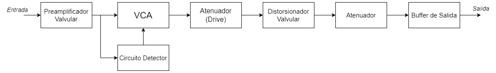
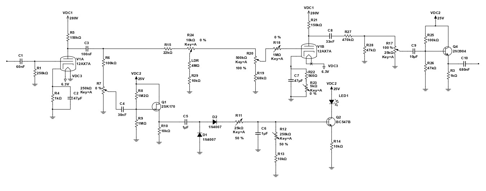
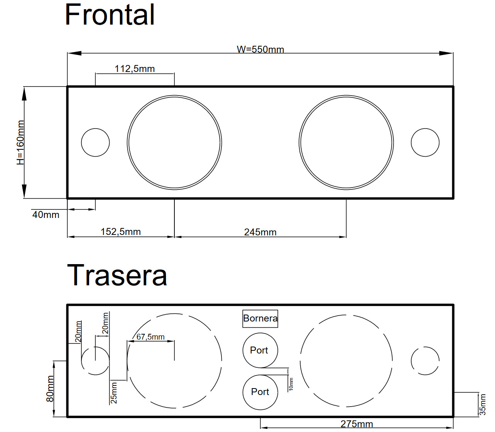
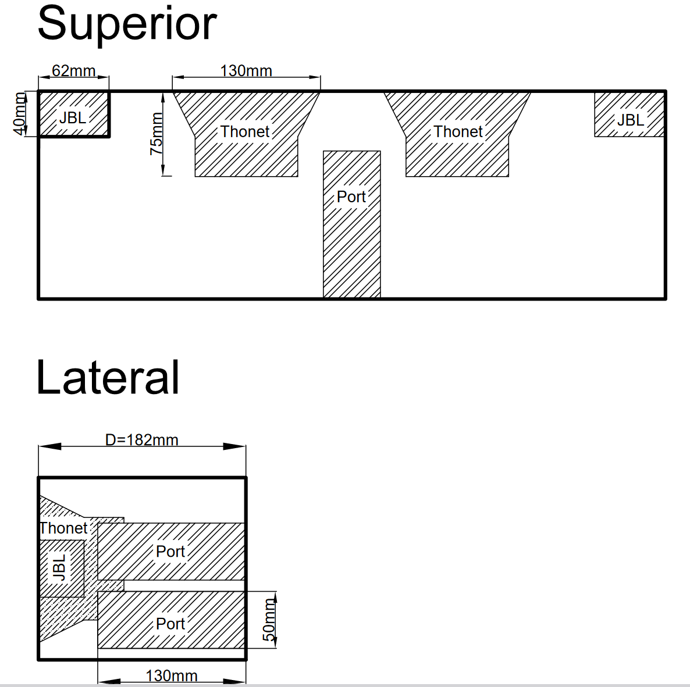
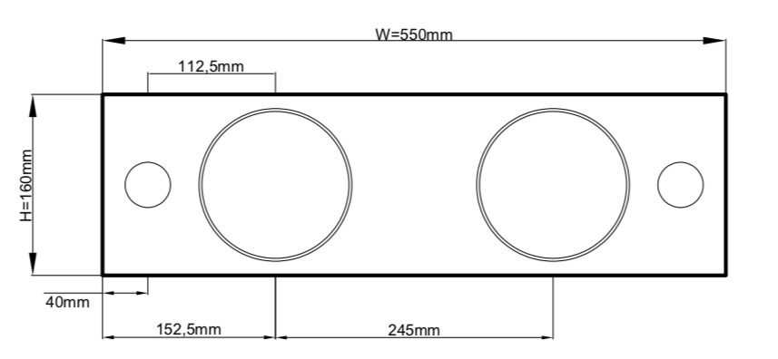

# Proyectos Académicos y Soluciones Técnicas | Alejo Cohen
*Desarrollo de proyectos con rigor profesional, orientados a brindar soluciones reales bajo estándares internacionales, dentro de un marco académico.*

[← Volver al inicio](README.md)

---

## 💻 Procesamiento Digital de Señales (DSP)
*Soluciones de software personalizadas para el análisis de señales.*

### Software de cálculo de parámetros acústicos (ISO 3382)
Desarrollo de una herramienta para el cálculo y análisis de parámetros acústicos mediante Respuestas al Impulso (RI).
Desarrollo de una herramienta integral en Python para el procesamiento y análisis de Respuestas al Impulso (RIR). El software automatiza el cálculo de parámetros normalizados según la norma ISO 3382 (RT, EDT, $C_{50}$, $C_{80}$ e IACC) y presenta los resultados mediante una interfaz gráfica (GUI) personalizada que permite la visualización y exportación de datos.

* [📄 Descargar Informe (PDF)](assets/pdf/software_parametros.pdf)

### Cálculo de aislamiento acústico (ISO 717-1 e ISO 12354-1)
Desarrollo de una herramienta computacional en Excel para la predicción del aislamiento a ruido aéreo en paramentos simples y la evaluación rigurosa de la transmisión por flancos. El software implementa modelos físico-teóricos (Ley de Masa, Sharp, Davy) y el método empírico de la norma ISO 12354-1. A su vez, el sistema automatiza el procesamiento de datos de mediciones in-situ (ISO 140-4 e ISO 16283-1) para la obtención y generación de informes de índices globales estandarizados, tales como $R_w$, $D_{n,w}$, $D_{nT,w}$, STC, junto con sus respectivos términos de adaptación espectral ($C$ y $C_{tr}$) bajo la norma ISO 717-1.

* [📊 Descargar Herramienta de Cálculo (ISO 140-4 e ISO 16283-1) (.xlsx)](assets/excel/Calculo_Aislamiento_ISO140_ISO16283.xlsx)
* [📊 Descargar Herramienta de Predicción por Flancos (ISO 12354-1) (.xlsx)](assets/excel/Prediccion_Aislamiento_Flancos_ISO12354.xlsx)

### Sustracción espectral para reducción de ruido
Implementación en Python de algoritmos de reducción de ruido aplicados a señales de voz, tomando como base el método de supresión espectral de Steven F. Boll. El trabajo comparó el algoritmo clásico con una propuesta alternativa propia, optimizando la caracterización del ruido ambiental mediante un promedio por banda de frecuencia en lugar de una magnitud espectral fija. El desempeño de los algoritmos y la mejora real en la relación señal/ruido se evaluaron de forma rigurosa utilizando parámetros cuantitativos objetivos.

* [📄 Descargar Informe (PDF)](assets/pdf/sustraccion_ruido.pdf)

## 🏛 Acústica Arquitectónica y Control de Ruido
*Mediciones in-situ, simulaciones predictivas y diagnósticos de campo.*

### Caracterización Acústica y Simulación: Usina del Arte
Estudio integral de una de las salas sinfónicas más prestigiosas del país. El proyecto consistió en dos etapas complementarias: la creación de un modelo computacional 3D utilizando el software EASE para el análisis predictivo de sus parámetros acústicos y la medición *in-situ* de la sala real, realizando un análisis integral mediante la evaluación de sus parámetros objetivos.
* [💻 Descargar Simulación Acústica en EASE (PDF)](assets/pdf/ease_usina.pdf)
* [📄 Descargar Caracterización Acústica por Medición In-situ (PDF)](assets/pdf/medicion_usina.pdf)

### Diagnóstico de Control Room Syntagma
Evaluación técnica y diagnóstico de respuesta en sala de control profesional. Se realizaron mediciones de respuesta al impulso en múltiples posiciones para analizar la homogeneidad espacial, la respuesta en frecuencia en el sweet spot y la identificación de los modos de la sala. El diagnóstico incluyó el diseño de filtros digitales de corrección basados en la curva de Harman y recomendaciones para la optimización del tratamiento acústico.
* [📄 Descargar Diagnóstico Acústico (PDF)](assets/pdf/diagnostico_controlroom.pdf)

### Control de Ruido Urbano en Predio Deportivo Vecinal
Estudio de impacto, diagnóstico y plan de mitigación de ruido en predio deportivo vecinal (AVEFA). El trabajo incluyó mediciones de niveles de presión sonora en condiciones reales de uso, el modelado del impacto en viviendas linderas y el diseño de soluciones de control de ruido (barreras y protocolos de actividad) para adecuar el predio a las normativas de ruido ambiental vigentes.
* [📄 Descargar Informe (PDF)](assets/pdf/ruido_avefa.pdf)

## 🔊 Electroacústica y Ensayos Normalizados
*Diseño de hardware y mediciones de laboratorio bajo normativas internacionales.*

### Preamplificador Valvular con Distorsionador y Compresor Óptico
Diseño, simulación y construcción física de un preamplificador valvular para guitarra eléctrica con distorsionador y compresor óptico. El circuito, diseñado en torno a una válvula 12AX7, incluye etapas de distorsión por corriente de grilla y un VCA basado en un fotorresistor (LDR) para el control dinámico (ataque, *release*, umbral y *ratio*). El proyecto abarcó desde el cálculo matemático de componentes y polarización, hasta el armado práctico y la verificación de respuesta con osciloscopio.

  
  

* [📄 Descargar Informe y Esquemático del Circuito (PDF)](assets/pdf/preamp_valvular.pdf)

### Barra de Sonido Estéreo
Diseño integral, construcción y medición de una barra de sonido estéreo de uso hogareño.

  
  
  

### Coeficiente de Absorción (ISO 354)
Ensayo de laboratorio para la medición y determinación del coeficiente de absorción de muestras acústicas. El proceso abarcó la medición del tiempo de reverberación en sala vacía y con muestra, el procesamiento de las colas de decaimiento y el análisis crítico del efecto de borde y las limitaciones del entorno de medición.
* [📄 Descargar Ensayo de Coeficiente de Absorción (PDF)](assets/pdf/medicion_absorcion.pdf)

### Potencia Acústica de Electrodomésticos (ISO 3743-2)
Medición de la potencia acústica de una licuadora de mano en condiciones normalizadas. El estudio incluyó la caracterización del espectro de emisión en bandas de tercio de octava, la corrección por ruido de fondo y la comparación del desempeño acústico entre diferentes modelos de licuadora.
* [📄 Descargar Informe de Medición de Potencia Acústica (PDF)](assets/pdf/potencia_acustica.pdf)

---
[← Volver al inicio](README.md)
